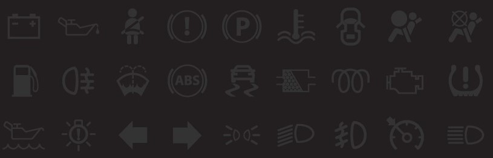

# 3. az elindulás

## Kötelességek

- KRESZ betartása
- ne zavarjunk másokat
- tartsuk be a szabályokat

## Veszélyeztetés, akadályozás, zavarás

> A veszélyeztetés fogalma: ha valaki a közúti közlekedés szabályainak megsértésével közúton vagy közforgalom elől el nem zárt magánúton más vagy mások életét, illetve testi épségét közvetlen veszélynek teszi ki.

Pl: váratlan fékezés

> A közúti akadályozás fogalma: ha valaki a közlekedés más résztvevőjét annak szándéka szerinti menetében, mozgásában, továbbjutásában indokolatlanul gátolja, hátráltatja, a célzottól eltérő közlekedési magatartásra (pl. fékezésre vagy irányváltoztatásra) kényszeríti.

Pl: valaki rossz helyen áll

> A zavarás fogalma: olyan magatartás, amellyel valaki más közlekedését nehezíti, a közlekedés más résztvevőjét megijeszti, kényelmetlenséget vagy kellemetlenséget okoz neki, magatartásával elvonja vagy indokolatlanul leköti a figyelmét.

Pl: valaki indokolatlanul dudál

## Aki a közlekedésben részt vesz, köteles a baleset elkerüléséért mindent megtenni!

## Telefon vezetés közben

- menet közben tilos minden figyelmet terelő tevékenység
- telefonálni azt kézben tartva tiltott (ezért kell kihangosító)

## A bizalmi elv

Azt jelenti, hogy számíthatunk arra, hogy mások is normálisak és
mások is számíthatnak arra, hogy az IQ szintünk a szobahőmérséklet fölött van.

## Műszerfal

- ellenőrző műszerek és jelzőlámpák
- napi km számlálót érdemes tankoláskor nullázni
- Lehet menni, ha a generátor hibás, nem tölt?
  - Lehet, de meg kell oldani

**Ha baj van:**
1. meghibásodás észlelése
2. megállás amint lehet
3. vészvillogó be

**Piros lámpák**
- hibát jelez
- meg kell állni

**Sárga lámpák**
- valami változás vagy kisebb hiba történt
- lehet még menni, de javítani kell

**Kék / Zöld lámpák**
- egy funkció be van kapcsolva

## Indulás előtti teendők

- kézifék behúzása
- váltó üresbe
- kuplung le
- iratok megvannak-e
- jól vagyok?

## Motorok

- Otto- / benzinmotorok
  - könnyebb hidegindítás
- dízelmotorok
  - nehezebb hidegindítás

**Hibrid hajtás**
- villany és belső égésű motor

**Tiszta elektromos**
- nincs gáz, se hang
- jól gyorsul
- kis hatótáv

## Motor indítása

0. kormányzár
1. kormányzár kioldva
2. elekromos berendezések
3. motorindító állás (csak indítás ideéig van itt a kulcs)

## Hidegindítás

- dízelmotornál nehezebb
- 80-95℃ az üzemi hőmérséklet

## Műszaki tippek

- próbálhatjuk többször indítani a kocsit, de 10 secnél tovább ne
- akksi állapotától is függ az indítása
- rossz akksi = veszélyes hulladék
- olajnyomás fontos

## Üzemanyag választás

- fontos előre tervezni
- Otto és dízel üzemanyagot nem keverjük!
- gázolajat csak dízelmotorhoz
- bioetanolt csak benzinmotoros kocsiba töltsünk, de nem lehet mindbe

## Kipufogó és motor kopás

- kipufogó tömítetlensége
  - figyeljük a nagy motorhangot
- motor kopása
  - ha a füst kékes színű, nem jó a helyzet
- kenőolaj csere
  - járműtől függ, hogy hány ezek km-enként
  - pálcával check-oljuk a szintet, de ne leállítás után azonnal
  - csak olyant töltsünk be, ami a motorban van

## Katalizátorok

- mérgező gázok ellen
- a motorvezérlés, a motor tüzelőanyagellátása, vagy a katalizátor hibájára utal a fura üllő szerű sárga fény izé
- tűzveszélyes, szóval ne füvön álljunk meg a kocsival

## Ha be kell lökni a kocsit

- katalizátoros kocsival ilyent nem játszunk

1. kormányzár ki, kézifék ki
2. gyorsítás külső erővel
3. kuplung és váltás kettesbe, utána gáz és erre indul a motor
4. ha sikerült, hagyjuk az akksit tölteni

## Sebesség váltás

- kisebb fokozaton jobb gyorsulás
- feladata:

> A motor és a hajtott kerekek fordulatszám tartományainak összehangolása, a menetellenállásoknak megfelelő hajtónyomaték beállítása, illetve hátramenet biztosítása.

## Elindulás lépései

1. kuplungot padlóig
2. váltás egyesbe
3. pici gáz
4. óvatosan kuplung föl
5. ha csökken a fordulatszám, megvan a csúszási pont, kuplungot helyén tartjuk
6. ha meg akarunk állni akkor kuplungot és féket le
7. váltót rakjuk üresbe és kézifék be, pedálokat elengedhetjük

**SIKK:** S – sebességváltás, I – irányjelzés, K – kézifék, K – körültekintés

## Index

- 60-120 villogás / perc jó
- nélküle tilos vezetni, ha kézzel nem tudjuk pótolni
- manőverek megkezdése előtt időben, de nem túl korán
- kanyarodó főúton nem kötelező, de lehet használni

**Használni kell:**
- induláskor
- kanyarodáskor
- előzéskor
- megálláskor
- sávváltáskor

## Összefoglalás

**Alapfogalmak**
- Veszélyeztetés, akadályozás, zavarás: a közlekedési partnerség alapkövetelménye, hogy másokat nem veszélyeztethet; azonban előfordulhatnak olyan vészhelyzetek, amelyeknek elhárítása érdekében megengedett a közlekedési partnerek zavarása, vagy akár akadályozása is.
- Bizalmi elv: számíthat rá, hogy a közlekedés szabályait mások is betartják, ugyanakkor közlekedőtársai is bízhatnak abban, hogy Ön is betartja az előírásokat.

**Műszerfal**
- ellenőrző, figyelmeztető lámpák,
- kapcsolók,
- ellenőrző műszerek

**Irányjelzés**
- Ha irányjelzője meghibásodik, és kézzel nem tud jelezni, nem közlekedhet tovább.
- A jelzések nem jelentenek utasítást a többi közlekedő számára.
- Jelezni kell: elinduláskor, kanyarodáskor, sávváltoztatáskor, előzéskor, megálláskor.
- A jelzés ne legyen megtévesztő

**Motortípusok és hajtásrendszerek**
- Belső égésű motorok (Otto-motorok, dízel); elektromos és hibrid meghajtású gépjárművek.
- Mindig a motortípusoknak megfelelő üzemanyagot tankolja!

## Ami véletlen kimaradt

ESP: jármű stabilitásának megőrzésére, kormány tartására